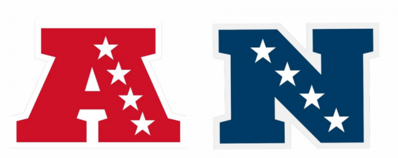
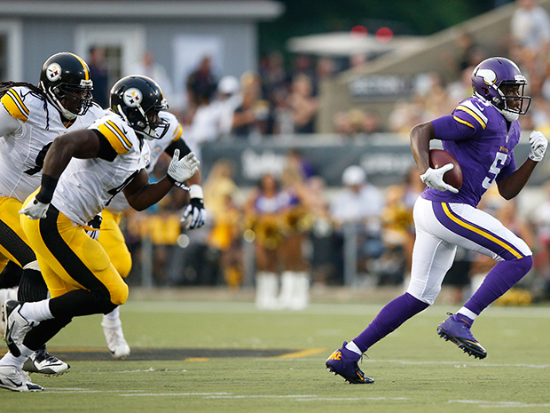
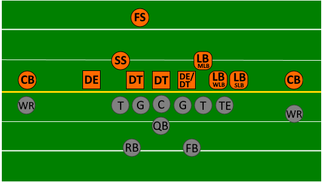

# Introduction

> - NFL summary data --> 2009 - 2018

### Focus: "Competitiveness" across the NFL

- Distributions of team success over time
- Differences across divisions (AFC vs NFC)
- Similarities in play styles (pass/run and offense/defense)
- Historical consistency of teams -- how likely are upsets?


***

# Data

- NFL season summaries from 2009 - 2018


### Identifying info:

- team name
- season
- division

### Outcome variables:

- wins/losses/ties
- points scored
- points allowed


***

# Data

### Offense / Defense Stats

- offensive points made

- expected points

- defensive points made

- expected defensive points

- broken up two ways:

    - passing vs running plays

    - per attempt vs total across season


***
# Manipulation: Creating New Variables

- more general divisions (removing north/south/east/west)
- win / loss ratio (wins / losses per season)
- win record (double positive, positive, negative, double negative)
- total offensive yards gained
- total defensive yards allowed

***

# Question 1: Competition by Division

```{r, echo = FALSE}

```


- 2 Major Divisions:
    - National Football Conference (NFC)
    - American Football Conference (AFC)

- Is either division becoming more competitive over time (fewer outlier teams)?
- Does either division appear to have clear dominant teams, or do a variety of teams take the spotlight in different years?

***

PLOT 1


***

PLOT 2

***


# Question 2:  Consistency

- Are the top teams consistently good?
- How much variation is there between teams across the years?
- Is the NFL competitive in terms of upset possibilities?


***

PLOT

***


# Question 3: Pass/Run


- Can teams remain competitive with different passing/running strategies?
- Does either passing or running dominate among the most competitive teams, or are play styles similar across all teams?


```{r, echo = FALSE}

```

***

PLOT

***


# Question 4: Offense/Defense

- Are offense and defense equally important for a team to be competitive?
- What separates the good teams from the bad teams?


```{r, echo = FALSE}

```

***

PLOT

***


***
# Conclusions

- The NFL is very consistent, and has remained so over time
- There are only a few teams that perform extraordinarily well
    - These are not the same every time
- The best teams are not unbeatable
    - Outliers show a chance for upsets
- The best teams pass more than average, but teams that run more can also succeed
- Different balances of offense and defense can lead to success. Not only one strategy!

***

# Limitations

- Passing vs Running and Offense vs Defense stats would be more informative if per-game, rather than per-season
    - Allow much more direct comparisons between yards and points
    - Averaging across the season is less accurate

- Only have data since 2009. Older data might look different.

- In addition to win/loss, would have liked overall rank in season


***

# Future Questions

- Can we determine the strength of the relationship between offense/defense and win probabilities?
    - Does one have a stronger mathematical relationship to chances of winning?

***


