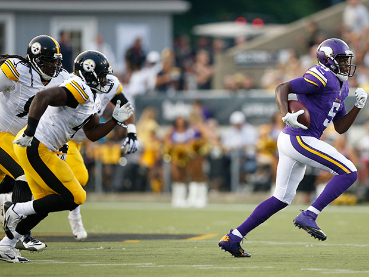

# Introduction

> - NFL summary data --> 2009 - 2018

### Focus: "Competitiveness" across the NFL

- Distributions of team success over time
- Differences across divisions (AFC vs NFC)
- Similarities in play styles (pass/run and offense/defense)
- Historical consistency of teams -- how likely are upsets?


***

# Data

- NFL season summaries from 2009 - 2018


### Identifying info:

- team name
- season
- division

### Outcome variables:

- wins/losses/ties
- points scored
- points allowed


***

# Data

### Offense / Defense Stats

- offensive points made

- expected points

- defensive points made

- expected defensive points

- broken up two ways:

    - passing vs running plays

    - per attempt vs total across season


***
# Manipulation: Creating New Variables

- more general divisions (removing north/south/east/west)
- win / loss ratio (wins / losses per season)
- win record (double positive, positive, negative, double negative)
- total offensive yards gained
- total defensive yards allowed

***

## Question 1: Divisions


```{r, echo = FALSE}

```


- 2 Major Divisions:
    - National Football Conference (NFC)
    - American Football Conference (AFC)

- Is either division becoming more competitive over time (fewer outlier teams)?
- Does either division appear to have clear dominant teams, or do a variety of teams take the spotlight in different years?

***

## Is either division becoming more competitive over time?


***

## Are there clear dominant teams, or are victories spread out across teams?


```{r, echo = FALSE, message = FALSE}
library(readr)
library(tidyverse)
nfl <- read_csv("nfl_teams_season_summary.csv")
afc <- c("AFC East", "AFC North", "AFC South", "AFC West")
nfc <- c("NFC East", "NFC North", "NFC South", "NFC West")

nfl <- nfl %>% mutate(div_general = ifelse(division %in% afc, "AFC", "NFC"))
nfl <- nfl %>% mutate(WLRatio = wins/losses)

# ggplot(top_teams_by_year, aes(x=season, y=WLRatio, fill = team)) +
#   geom_bar(stat = "identity", position = "dodge", col = "black") +
#   facet_wrap(~div_general) +
#   scale_fill_manual(
#     breaks = c("ATL", "CAR", "CIN", "DAL", "DEN", "GB", "IND", "KC", "LA", "LAC", "MIN", "NE", "NO", "PHI", "PIT", "SEA"),
#     values = c("darkred", "turquoise2", "darkorange2", "gray77", "black", "darkgreen", "darkblue", "red", "goldenrod2", "powderblue", "purple", "blue", "tan", "aquamarine4", "yellow", "chartreuse1"),
#     labels = c("Atlanta Falcons", "Carolina Panthers", "Cincinnati Bengals", "Dallas Cowboys", "Denver Broncos", "Green Bay Packers", "Indianapolis Colts", "Kansas City Chiefs", "LA Rams", "LA Chargers", "Minnesota Vikings", "New England Patriots", "New Orleans Saints", "Philadelphia Eagles", "Pittsburgh Steelers", "Seattle Seahawks")) +
#   theme(legend.position = "bottom") +
#   labs(
#     x = NULL,
#     y = "Win / Loss Ratio",
#     title = "The Best Performing NFL Teams",
#     subtitle = "The AFC has more consistent top teams than NFC",
#     fill = NULL) +
#   scale_x_continuous(
#     breaks = c(2009, 2010, 2011, 2012, 2013, 2014, 2015, 2016, 2017, 2018),
#     labels = c("'09", "'10", "'11", "'12", "'13", "'14", "'15", "'16", "'17", "'18"))

top_teams_by_year <- nfl %>%
  group_by(season, div_general) %>%
  select(season, team, WLRatio) %>% top_n(n=1)

ggplot(top_teams_by_year, aes(x=season, y=WLRatio, fill = team)) + geom_bar(stat = "identity", position = "dodge", col = "black") +
  facet_wrap(~div_general) +
  scale_fill_manual(breaks = c("ATL", "CAR", "CIN", "DAL", "DEN", "GB", "IND", "KC", "LA", "LAC", "MIN", "NE", "NO", "PHI", "PIT", "SEA"),
                    values = c("darkred", "turquoise2", "darkorange2", "gray77", "black", "darkgreen", "darkblue", "red", "goldenrod2", "powderblue", "purple", "blue", "tan", "aquamarine4", "yellow", "chartreuse1"),
                   labels = c("Atlanta Falcons", "Carolina Panthers", "Cincinnati Bengals", "Dallas Cowboys", "Denver Broncos", "Green Bay Packers", "Indianapolis Colts", "Kansas City Chiefs", "LA Rams", "LA Chargers", "Minnesota Vikings", "New England Patriots", "New Orleans Saints", "Philadelphia Eagles", "Pittsburgh Steelers", "Seattle Seahawks")) + theme(legend.position = "bottom") + labs(x = NULL, y = "Win / Loss Ratio", title = "The Best Performing NFL Teams", subtitle = "The AFC has more consistent top teams than NFC", fill = NULL) + scale_x_continuous(breaks = c(2009, 2010, 2011, 2012, 2013, 2014, 2015, 2016, 2017, 2018), labels = c("'09", "'10", "'11", "'12", "'13", "'14", "'15", "'16", "'17", "'18"))


```{r, fig.height=6, fig.width=11}
library(cowplot)
library(magick)

top_teams_by_year %>%
    group_by(team, div_general) %>%
    summarise(n = n()) %>%
    mutate(n = factor(n, levels = 1:10)) %>%
    ggplot(aes(x = n)) +
        geom_bar(aes(fill = div_general)) +
        scale_fill_manual(drop = F, values = c("red", "blue")) +
        scale_x_discrete(drop=FALSE) +
        # facet_wrap(~div_general) +
        labs(title = "Finishes in the top 4 win/loss ratio from 2009-2018") +
        theme_bw() -> plt
plt

sv <- 0.09
jaguars <-  "http://loodibee.com/wp-content/uploads/nfl-jacksonville-jaguars-team-logo-2-768x768.png"
chargers <- "http://loodibee.com/wp-content/uploads/nfl-los-angeles-chargers-team-logo-2-768x768.png"
jets <- "http://loodibee.com/wp-content/uploads/nfl-new-york-jets-team-logo-768x768.png"
raiders <- "http://loodibee.com/wp-content/uploads/nfl-oakland-raiders-team-logo-768x768.png"
ravens <- "http://loodibee.com/wp-content/uploads/nfl-baltimore-ravens-team-logo-2-768x768.png"
bengals <- "http://loodibee.com/wp-content/uploads/nfl-cincinnati-bengals-team-logo-768x768.png"
texans <- "http://loodibee.com/wp-content/uploads/nfl-houston-texans-team-logo-2-768x768.png"

x <- seq(from = -0.405, to = 0.6, by = 0.079)

ggdraw() +
    draw_plot(plt) +
    draw_image(jaguars, x = x[1], y = 0.27, scale = sv) +
    draw_image(chargers, x = x[1], y = 0.13, scale = sv) +
    draw_image(jets, x = x[1], y = -0.01, scale = sv) +
    draw_image(raiders, x = x[1], y = -0.15, scale = sv) +
    draw_image(chargers, x = x[1], y = -0.29, scale = sv) +
    draw_image(ravens, x = x[2], y = -0.29, scale = sv) +
    draw_image(bengals, x = x[3], y = -0.15, scale = sv) +
    draw_image(texans, x = x[3], y = -0.29, scale = sv) +
    draw_image(texans, x = x[4], y = -0.29, scale = sv) +
    draw_image(texans, x = x[5], y = -0.29, scale = sv) +
    draw_image(texans, x = x[6], y = -0.29, scale = sv) +
    draw_image(texans, x = x[10], y = -0.29, scale = sv)
```

```{r}
top_teams_by_year %>%
    group_by(team, div_general) %>%
    summarise(n = n()) %>%
    filter(div_general == "AFC") %>%
    arrange(n)
```

***

# Takeaways - Divisions

### Competitiveness over time


### Competitiveness across divisions


***

## Question 2: Pass/Run


Can teams remain competitive with different passing/running strategies?

Does either passing or running dominate among the most competitive teams, or are play styles similar across all teams?


```{r, echo = FALSE}

```

***

## Observations: Pass vs Run

```{r, echo = FALSE}
nfl_passrun <- nfl %>%
  mutate(pass = pass_off_total_yards_gained/(pass_off_total_yards_gained + run_off_total_yards_gained), run = run_off_total_yards_gained/(pass_off_total_yards_gained + run_off_total_yards_gained))

#nfl %>% group_by(div_general, team) %>%
#  summarize(mean_WL = mean(WLRatio)) %>%
#  arrange(desc(mean_WL)) %>%
#  head(10)

top10 <- c("NE", "GB", "CAR", "LA", "NO", "LAC", "PIT", "IND", "DEN", "ATL")
nfl_passrun <- nfl_passrun %>% filter(team %in% top10) %>% select(team, season, pass, run)

nfl_passrun %>% gather(key = "type", value = "pct", pass, run) %>%
  group_by(team, type) %>%
  summarize(pct = mean(pct)) %>%
  ggplot(aes(x=team, y=pct, fill = type)) + geom_bar(stat = "identity", position = "fill") + geom_hline(yintercept = 0.331, linetype = "dashed") + xlab(NULL) + ylab("% of Offensive Yards") + labs(title = "What Makes A Top Team? Running or Passing?", subtitle = "The most competitive teams play similarly to each other, but pass more than average", fill = "Play Type")
```


***

## Question 3: Offense/Defense

Are offense and defense equally important for a team to be competitive?

What separates the good teams from the bad teams?


```{r, echo = FALSE}
knitr::include_graphics("positions.png")
```


***
### Observations: Offense/Defense

-  There are very few teams that only have a good offense OR defense

-  Teams that perform well appear to be good at both
    - High scoring
    - Don't allow many points


```{r, echo = FALSE, message = FALSE}
library(plotly)
nfl <- nfl %>% mutate(record = ifelse(WLRatio > 2, "Double Positive", ifelse(WLRatio >= 1, "Positive", ifelse(WLRatio >= 0.5, "Negative", "Double Negative"))),
                      total_offensive_gained = run_off_total_yards_gained + pass_off_total_yards_gained,
                      total_defensive_allowed = run_def_total_yards_allowed + pass_def_total_yards_allowed)

nfl$record <- factor(nfl$record, levels = c("Double Positive", "Positive", "Negative", "Double Negative"))

ggplot(nfl, aes(x=total_defensive_allowed, y=total_offensive_gained, col = record, label = team)) + geom_point() + scale_color_manual(breaks = c("Double Positive", "Positive", "Negative", "Double Negative"), values = c("green", "gold", "darkorange1", "red")) + labs(x = "Total Defensive Yards Allowed in Season", y = "Total Offensive Yards Gained in Season", col = "Win Record") + theme(legend.position = "bottom") -> p
ggplotly(p)
```    

***    
- What separates a bad team from the worst teams?
    - The *worst* teams have very poor offenses
    - A good defense does not guarantee that a team is competitive

```{r, echo = FALSE, message = FALSE}
ggplotly(p)
```


***    

- What separates a good team from a bad team?
    - Worse *defensive* performance
    - Offense is important, but you can't neglect your defense!

```{r, echo = FALSE, message = FALSE}
ggplotly(p)
```

***


ggplot(nfl, aes(x=total_defensive_allowed, y=total_offensive_gained, col = record,
                label=team)) +
    geom_point() +
    scale_color_manual(breaks = c("Double Positive", "Positive", "Negative"),
                       values = c("green", "gold", "red")) +
    labs(title = "Offense and Defense Strength",
         subtitle = "Competitive teams are typically good at both",
         x = "Total Defensive Yards Allowed in Season",
         y = "Total Offensive Yards Gained in Season", col = "Win Record") -> p


library(plotly)
head(nfl)

- What separates a good team from a great team?
    - Sometimes defensive improvement, sometimes offensive
    - **Big Idea:** You can remain competitive with different styles of play!

```{r, echo = FALSE, message = FALSE}

ggplotly(p)
```


***

## Question 4: Consistency

- Are the top teams consistently good?

- How much variation is there between teams across the years?

- Is the NFL competitive in terms of upset possibilities?

***

## Graphing consistency

```{r, echo = FALSE, warning = FALSE}
ggplot(nfl, aes(x=reorder(team, WLRatio, FUN = median), y = WLRatio, fill = div_general)) +
  geom_boxplot() +
  theme(axis.text.x = element_text(angle = 90, hjust = 1)) +
  xlab(NULL) +
  ylab("Win / Loss Ratio") +
  labs(
    title = "The Top Teams Aren't Always Consistent",
    subtitle = "The NFL appears very competitive, with decent upset chances",
    fill = "Division") +
  geom_hline(
    yintercept = 1,
    linetype = "dashed",
    color = "red")
```

***

```{r, echo = FALSE}
ggplot(nfl, aes(x=reorder(team, WLRatio, FUN = median), y = WLRatio, fill = div_general)) +
    geom_boxplot() +
    theme(axis.text.x = element_text(angle = 90, hjust = 1)) +
    xlab(NULL) +
    ylab("Win / Loss Ratio") +
    labs(title = "The Top Teams Aren't Always Consistent",
         subtitle = "The NFL appears very competitive, with decent upset chances",
         fill = "Division") +
    geom_hline(yintercept = 1, linetype = "dashed", color = "red")

### Zooming in:

- A few teams that are consistently bad
- Most decent to good teams have significant performance variation
- Notable outliers: Carolina, Green Bay, Indianapolis
- Outliers + variation = chance for upsets
- Divisions seem somewhat balanced in terms of skill

```{r, echo = FALSE, warning = FALSE}
ggplot(nfl, aes(x=reorder(team, WLRatio, FUN = median), y = WLRatio, fill = div_general)) +
  geom_boxplot() +
  theme(axis.text.x = element_text(angle = 90, hjust = 1)) +
  xlab(NULL) +
  ylab("Win / Loss Ratio") +
  labs(
    title = "The Top Teams Aren't Always Consistent",
    subtitle = "The NFL appears very competitive, with decent upset chances",
    fill = "Division") +
  geom_hline(
    yintercept = 1,
    linetype = "dashed",
    color = "red") +
  ylim(0,4.5)

```

***
# Conclusions

- The NFL is very consistent, and has remained so over time
- There are only a few teams that perform extraordinarily well
    - These are not the same every time
- The best teams are not unbeatable
    - Outliers show a chance for upsets
- The best teams pass more than average, but teams that run more can also succeed
- Different balances of offense and defense can lead to success. Not only one strategy!

***

# Limitations

- Passing vs Running and Offense vs Defense stats would be more informative if per-game, rather than per-season
    - Allow much more direct comparisons between yards and points
    - Averaging across the season is less accurate

- Only have data since 2009. Older data might look different.

- In addition to win/loss, would have liked overall rank in season


***

# Future Questions

- Can we determine the strength of the relationship between offense/defense and win probabilities?
    - Does one have a stronger mathematical relationship to chances of winning?

***
